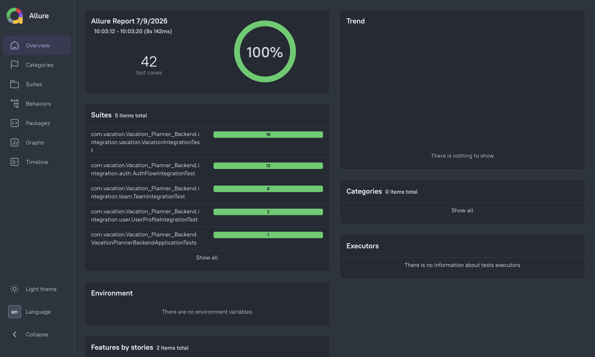
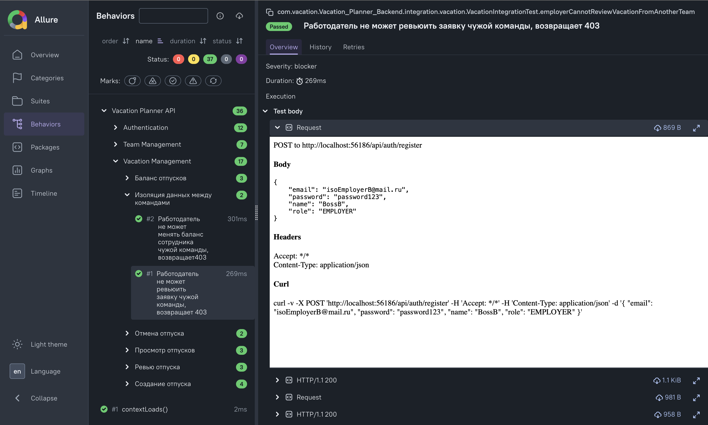
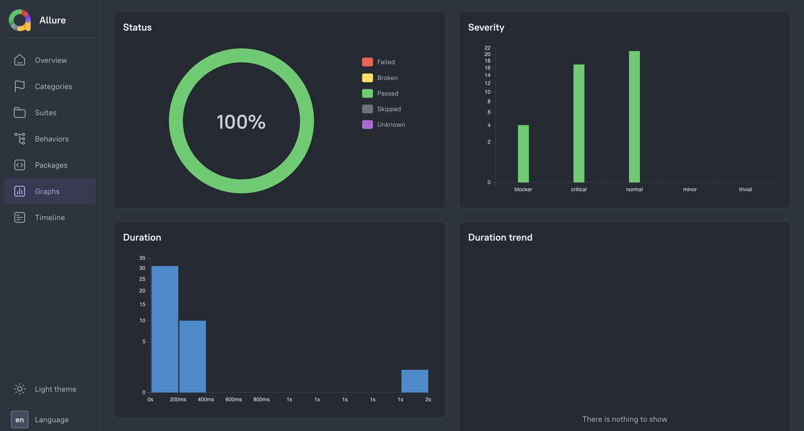

# Vacation Planner — Backend

[](https://github.com/S1notik/Vacation-Planner-Backend/actions/workflows/ci.yml)

REST API для управления отпусками сотрудников. Работодатели создают команды, управляют заявками на отпуск и балансом дней; сотрудники подают и отслеживают свои заявки.

> Android — в [отдельном репозитории](https://github.com/S1notik/Vacation-Planner-Android).
 
---

## Стек

### Основа


### Инфраструктура


### Тестирование


 
---

## Архитектура

Многослойная структура с разделением ответственности:

```
config/          — конфигурация Spring (Security, Redis)
security/        — JWT-фильтр, сервис токенов, blacklist
controller/      — REST-контроллеры
service/         — интерфейсы бизнес-логики
service/impl/    — реализация сервисов
model/entity/    — JPA-сущности
model/enums/     — перечисления (Role, Status, NotificationType)
repository/      — Spring Data JPA репозитории
dto/             — объекты передачи данных (Request/Response)
exception/       — типизированные исключения и глобальный обработчик
```

Схема БД управляется миграциями **Liquibase** (single source of truth), Hibernate работает в режиме `ddl-auto: validate`.

**Обработка ошибок** построена на типизированных исключениях (`ConflictException` → 409, `NotFoundException` → 404, `BadRequestException` → 400, Spring `AccessDeniedException` → 403). `GlobalExceptionHandler` матчит их по типу, а не по тексту сообщения.
 
---

## CI

Каждый push в `main` и каждый Pull Request автоматически прогоняют весь набор интеграционных тестов через **GitHub Actions**.

Конфигурация: [`.github/workflows/ci.yml`](.github/workflows/ci.yml)
 
---

## Тестирование

**41 интеграционный тест**, покрывающий аутентификацию, профиль пользователя, работу с командами и полный цикл заявок на отпуск, включая проверки изоляции данных между командами.

Тесты выполняются на **реальном PostgreSQL** в Docker-контейнере (не in-memory), поэтому проверяют в том числе миграции Liquibase и специфику Postgres.

**Стек тестирования:**
- **Testcontainers** — поднимает реальный PostgreSQL в контейнере на время тестов (singleton-контейнер, общий для всех классов);
- **REST Assured** — HTTP-запросы к приложению и проверка ответов;
- **JUnit 5** — каркас тестов, параметризация;
- **Mockito** (`@MockitoBean`) — подмена внешних зависимостей (Redis blacklist);
- **Allure** — отчётность с группировкой по фичам, severity и логированием HTTP-запросов.
  **Что покрыто:**
- **Auth** — регистрация (в том числе с указанием должности), вход, обновление токена, валидация пароля, защита эндпоинтов (без токена / с битым токеном → 403);
- **Profile** — просмотр и частичное обновление профиля, персистентность данных между сессиями;
- **Teams** — создание, вступление по инвайт-коду, участники, календарь, повторное вступление, повышение роли до `EMPLOYER` при создании команды;
- **Vacations** — подача/просмотр/отзыв заявок, ревью, баланс дней, единый учёт использованных дней, авто-одобрение заявок работодателя;
- **Безопасность** — изоляция данных между командами (работодатель не может ревьюить чужую заявку или менять чужой баланс → 403).
  Запуск тестов:
```bash
mvn clean test
```

Отчёт Allure:
```bash
allure serve target/allure-results
```




 
---

## API Endpoints

### Auth
| Метод | URL | Описание |
|---|---|---|
| POST | `/api/auth/register` | Регистрация (поле `jobTitle` — опционально) |
| POST | `/api/auth/login` | Вход |
| POST | `/api/auth/logout` | Выход (blacklist токена) |
| POST | `/api/auth/refresh` | Обновление токена |

Истёкший access-токен возвращает `401 {"error": "Token expired"}` — клиенту следует выполнить refresh и повторить запрос.

### Users
| Метод | URL | Описание | Роль |
|---|---|---|---|
| GET | `/api/users/me` | Профиль текущего пользователя | Любая |
| PATCH | `/api/users/me` | Частичное обновление профиля | Любая |

### Teams
| Метод | URL | Описание | Роль |
|---|---|---|---|
| POST | `/api/teams` | Создать команду (роль повышается до `EMPLOYER`) | Любая, без команды |
| POST | `/api/teams/join` | Вступить по инвайт-коду | EMPLOYEE |
| GET | `/api/teams/members` | Участники команды | Любая |
| GET | `/api/teams/calendar` | Календарь отпусков | Любая |

### Vacations
| Метод | URL | Описание | Роль |
|---|---|---|---|
| POST | `/api/vacations` | Подать заявку (у работодателя — авто-одобрение) | EMPLOYEE, EMPLOYER |
| GET | `/api/vacations/my` | Мои заявки | EMPLOYEE, EMPLOYER |
| GET | `/api/vacations/balance` | Баланс дней | EMPLOYEE, EMPLOYER |
| GET | `/api/vacations/team` | Все заявки команды | EMPLOYER |
| PUT | `/api/vacations/{id}/review` | Одобрить/отклонить | EMPLOYER |
| DELETE | `/api/vacations/{id}` | Отозвать заявку (только `PENDING`) | EMPLOYEE, EMPLOYER |
| PUT | `/api/vacations/balance/{employeeId}` | Установить баланс сотруднику | EMPLOYER |
| PUT | `/api/vacations/balance/team` | Установить баланс команде | EMPLOYER |

### Notifications
| Метод | URL | Описание |
|---|---|---|
| GET | `/api/notifications` | Получить уведомления |
| PATCH | `/api/notifications/{id}/read` | Прочитать уведомление |
| PATCH | `/api/notifications/read-all` | Прочитать все |
 
---

## Запуск проекта

### Требования
- Docker
- Docker Compose
### 1. Клонировать репозиторий
```bash
git clone https://github.com/S1notik/Vacation-Planner-Backend.git
cd Vacation-Planner-Backend
```

### 2. Создать `.env` файл в корне проекта
```env
DB_URL=jdbc:postgresql://db:5432/VacationPlanner
USERNAME=your_db_username
SECRET_PASSWORD=your_db_password
POSTGRES_DB=VacationPlanner
JWT_SECRET=your_256_bit_secret_key
JWT_EXPIRATION=3600000
JWT_REFRESH_EXPIRATION=2592000000
```

### 3. Запустить
```bash
docker compose up --build
```

Приложение будет доступно на `http://localhost:8080`.
 
---

## Безопасность

- **JWT-токены** — stateless аутентификация (access + refresh);
- **Redis Blacklist** — отзыв токенов при logout;
- **BCrypt** — хэширование паролей;
- **Role-based access** — разграничение прав через `@PreAuthorize`;
- **Изоляция данных** — пользователь имеет доступ только к данным своей команды (проверяется на уровне сервиса, покрыто тестами);
- **Валидация** — проверка входящих данных через `@Valid`.
---

## Роли пользователей

| Роль | Описание |
|---|---|
| `EMPLOYER` | Создаёт команду, управляет заявками и балансом отпусков. Собственные заявки одобряются автоматически |
| `EMPLOYEE` | Подаёт заявки, отслеживает статус и баланс |

Роль назначается при регистрации, но пользователь без команды может создать свою — в этом случае он автоматически становится `EMPLOYER`.